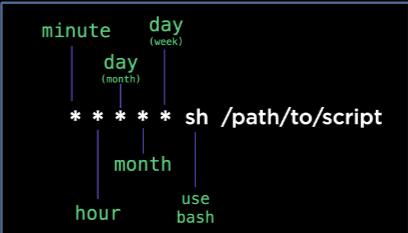
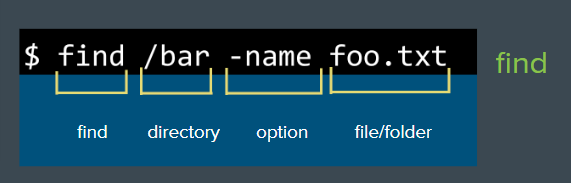

# CI / CD

**Continuous Integration** - Code changes are validated and merged back into main branch as often as possible.

**Continuous Delivery** - Code changes are automatically built and ready for production.

**Continuous Deployment** - Builds are automatically deployed to production environments.

> CI/CD is not only about pushing your code faster. It is about validating your code and making sure it is ready to go as possible. So when we will put it into production then there should be no question about what will happen. Testing is the core & crux of CI/CD.

## CRON

- It executes commands on a schedule.
- `crontab.guru`

- **Shows Cronjobs** - `crontab -e`
- **Follow the output of a file** - `tail -f`
- **Output the first part of a file** - `head`
- **Output the last part of file** - `tail`
- **Output one page at time** - `less`
- **Output entire file** - `cat`

## Standard Streams

- standard output - `stdout`
- standard input - `stdin`
- standard error - `stderr`
- read from stdout - `|`
- write stdout to file - `>`
- append stdout to file - `>>`
- read from stdin - `<`
- redirect both stderr & stdout - `2>&1`

## Finding Things

- `find` - search file names
    - Example - `sudo find / -type d -name log` or `sudo find /var/log -type f -name "*.log"`
- `grep` - search file contents

## TO Run Last Command with Sudo

- `sudo !!`