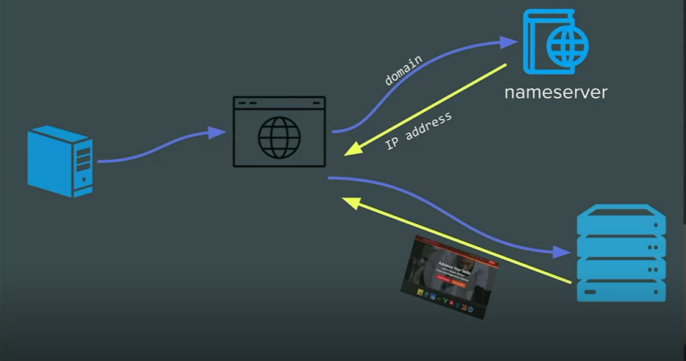

# DNS and how it works

## What is DNS

- DNS stands for Domain Name System

- It is simply a technology which allows anyone to resolve host name like `google.com` , `microsoft.com` something like IP-ADDRESS. 

- For example -> `google.com` as `142.250.193.46`.

- It's the naming database that locates and translates internet domain names into IP addresses. Similiar to phone contact list which matches contact name to t's phone number.

- As more than 1 person can access to the same domain name at the same time so a domain name can corresponds to more than one IP address Each will receive a unique IP address from different servers.

- If we will have only one IP address then that will make everyone to wait up for their turn for opening the domain name.

- The main task of DNS is to find the IP Address associated with the given domain name. The process of finding the IP Address is known as DNS Lookup.

## DNS Resolver

- Basically DNS Resolver is the hard coded IP Address which our computers uses to connect to any site (ex - `google.com`)

## How DNS works

When you will type `www.example.com` then it will actually search for `www.example.com.`(Dot at the end of the call). That `Dot` at the end represent's `The ROOT` of the internet's namespace.

- When you will search for `www.google.com.` then our `OS` and `Browser` will search in themselves for that url. It could be configured into computer or it could be `cache` (memory).
- Now if both OS and Browser don't know the IP address of this domain name then they are configured ask for that to `Resolving Name Server`. RNS is configured both manually and automatically.
- It's possible that RNS don't have IP addrress in thier memory or cache but they do know whom to ask about this(`The ROOT`) and that is `.com name server`.
- `.com` name server or `TLD` name server may don't know what's that but they do know where to find that and that is `Autorative Name Server (ANS)`.
- TLD know which ANS we can ask for this by the `Registrar` as when someone buys domain then registrar is told which ANS to use for this domain. They notify the organization responsible for Top Level Domain which is `Registry`  and tell them to update `TLD Name Server`.
- Now ANS tell us the IP address which we puts into `cache` and pass to the OS and then OS will pass that to the Web Browser and browser will make a connection to the  IP address and displays our search.
- As we already have saved that ip address into our `cache`, due to this in future if we will ever search for the same IP Address then it will save some time. 

## Vulnerabilities

- Cache Posioning
- Malicious creation of Misleading Domain Names for fishing attacks

## Looking the nameservers for an domain

- `nslookup frontendmasters.com`

## Lookup the DNS records for a domain

- `dig frontendmasters.com`

## View Browser DNS Cache
- **Chrome** - `chrome://net-internals/#dns`
- **Firefox** - `about:networking#dns`
