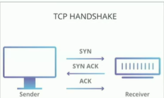
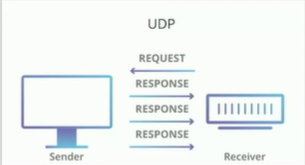

- `Internet` - a network of networks
- `Intranet` - private network (Most of the corporation do have it nowadays)
- `LAN` - Local Area Network (To access the game together we need to be at same network during old time)
- `WAN` - Wide Area Network
- `IP` - Internet Protocol
- `IP Address` - numeric label assigned to an internet connected devices
- `TCP` - Transmission Control Protocol
    - TCP does the work of sending the file to sender then sender checks that the file is complete or not if not then sender will say to TCP that i only got 90% of the file. But these packets are missing.
    - Then TCP will send the rest of the file. This process happens continously until we gets the full file.

- `UDP`- User Datagram Protocol
    - UDP on the other hand of TCP doesn't care. 
    - UDP is like, hey you need a file, catch. If you catch or not who knows.
    - UDP is one way.

### When do we need TCP or UDP?

- It depends on what we are sending and whether it needs to respond one after another or it can be assembled after the fact.
- UDP is used for streaming video. As we will not go back and start from the start if any frame will be missing. Also is streaming video it does not matter if we lose a couple of packet.
- UDP is faster in real time data like Wipe and Video.
- TCP is much slower but much more reliable than UDP. We can stream video on TCP but TCP is also bandwidth-intensive, meaning that it requires a lot of bandwidth to stream video. 
- This is because video streaming requires a constant stream of data to be transferred. If the bandwidth is not sufficient, the video will be choppy or even stop altogether. In addition, TCP can be sensitive to packet loss, which can also cause problems with video streaming.
- To address these challenges, there are a number of techniques that can be used to improve the performance of TCP for video streaming. These include:
    - Using a higher bitrate for the video stream. This will require more bandwidth, but it will result in a smoother and more reliable video stream.
    - Using a congestion control algorithm that is specifically designed for video streaming. This will help to ensure that the video stream is not interrupted by packet loss or congestion.
    - Using a protocol that is more bandwidth-efficient than TCP. For example, HTTP/2 is a newer protocol that is designed to be more efficient for streaming media.

- `ICMP` - Internet COntrol Message Protocol. It is generally build over TCP or UDP, generally TCP.
- `Packet` - Unit of data transmitted over a network.
- `Ping of Death` - A ping of death (PoD) attack is a type of denial-of-service (DoS) attack in which an attacker sends an oversized ICMP packet to a target computer. The oversized packet causes the target computer to crash or freeze, making it unavailable to legitimate users.
- `DNS` - Domain Name System
- `Nameserver` - hold DNS records to translate domain names into IP addresses.
- `A record` - maps name to IP address
- `CNAME` - maps name to name
- `URL` - Uniform Resource Locator