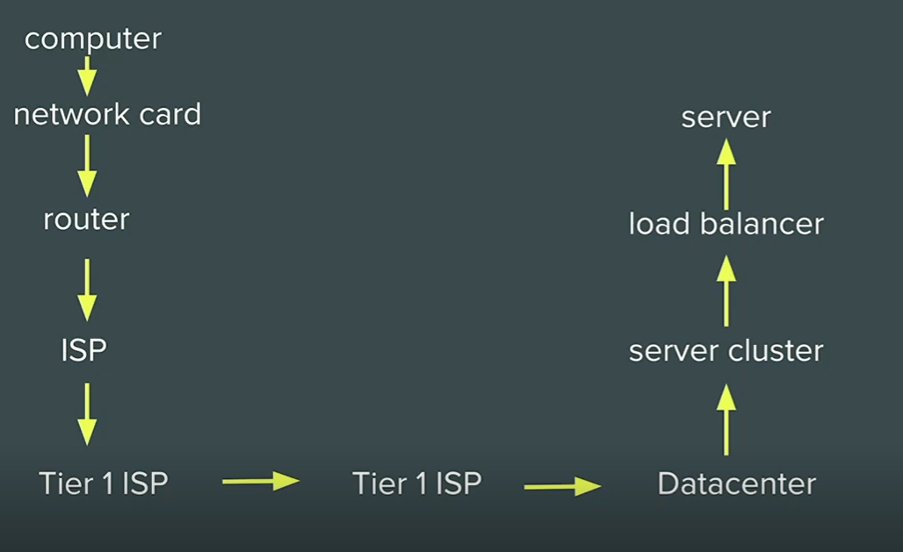

# How Internet Works

[How Internet Works Video Explantion](https://www.youtube.com/watch?v=7_LPdttKXPc)

## What actually Internet is ?

- The Internet is not a fuzzy cloud. The internet is a wire, actually buried in the ground. Computers connected directly to the internet are called `Servers`, while the computers you and I use are "clients," because they are not connected directly to the internet, but through an Internet Service Provider. Routers shuttle packets of information across the internet, and transmit e-mail, pictures, and web pages.

## How  it Works

- Ever wonder how the Internet works? You won’t believe how simple it is. The Internet is a global computer network for communication – actually nothing more than a basic computer network. The Internet simply moves data from one place to another, so that we can chat, browse and share.

- Data moves over the Internet in a manner called “packet switching.” What packet switching basically does is send your data in separate pieces – each tagged with your intended destination. Once all of the pieces reach their target, they are reassembled into – voila! – your email. Packets flow by many routes, each determined by the quickest and most efficient at the time you send your email.

- If you had a permanent connection to the intended destination or if your email traveled as a whole instead of in pieces, an entire portion of the network would be blocked every time you sent a message. With packet switching, many people can use the Internet at the same time.

- There are millions upon millions of servers on the Internet. Servers store information. There are file servers, mail servers and web servers. The Internet is also made up of routers. Routers simply make connections between different systems. For instance, at work or school, where several computers are networked, you are connected to one router – a single point of entry for the Internet.

- `Tier 1 ISP` is the backbone here.

