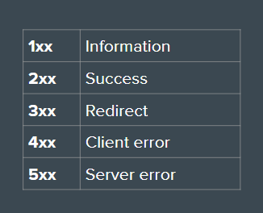
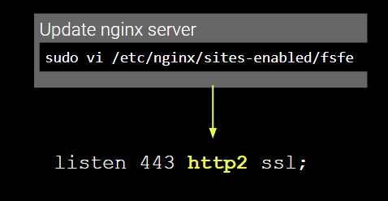

# HTTP & HTTPS

### Status Codes

## For HTTPS Security Certificate

- Install and use certbot - [Follow this Link](https://certbot.eff.org/instructions)
- Open Firewall

## To Change from HTTP/1 to HTTP/2

