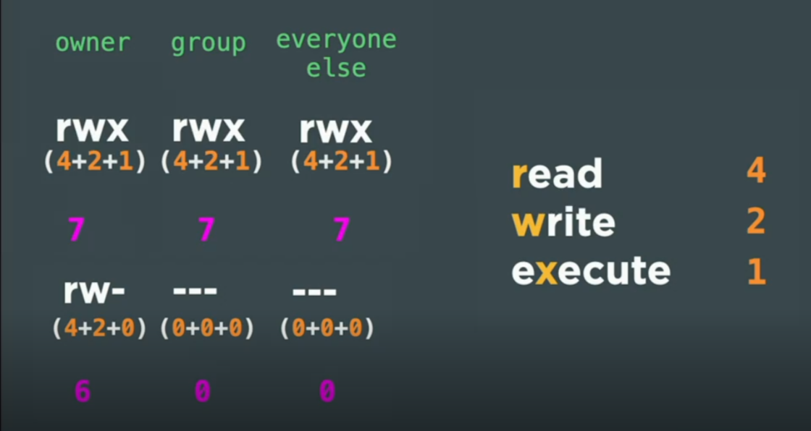
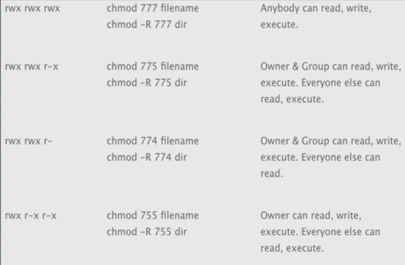

# Security

- **Changing file permission** - `chmod 644 ~/.ssh/authorized_keys`
- **Disable root login** - `sudo vi /etc/ssh/sshd_config`
- **Restart ssh daemon** - `sudo service sshd restart`

## What could someone do if they gained root access to your server?

- They can download as many stuffs as they want.
- Now that they have access to root so they also have access to ssh key and with the help of that they can easily get the access to our github and mainly in github we do have our company connection too. SO then they can easily get into our company data. Ironic point is that you never meant any of this.

- **TO Check the Already Acquired Port** - `less /etc/services`

**How to check the open ports**
- `sudo apt install nmap`
- `nmap <your_ip_address>`

### ***How can someone overload a server with a large number of reject error packets? How can we resolve this issue? Can the REJECT ufw command help us?***

A distributed denial-of-service (DDoS) attack is a malicious attempt to overload a server or network with so much traffic that it becomes unavailable to legitimate users. One way to do this is to send a large number of reject error packets to the server. These packets are essentially useless, but they can still consume a lot of resources on the server, making it difficult for it to handle legitimate traffic.

There are a few things you can do to resolve this issue:

* **Use a firewall to block the incoming traffic.** This can be done with a hardware firewall or a software firewall like ufw.
* **Configure your firewall to reject error packets.** This will prevent the server from wasting resources processing them.
* **Use a DDoS mitigation service.** These services can help to protect your server from DDoS attacks by absorbing the attack traffic and preventing it from reaching your server.

REJECT ufw can help to protect your server from DDoS attacks by rejecting error packets. This will prevent the server from wasting resources processing them. However, it is important to note that REJECT ufw is not a complete solution to DDoS attacks. It is only one layer of defense that should be used in conjunction with other security measures.

Here are some additional tips to help protect your server from DDoS attacks:

* Keep your software up to date.
* Use strong passwords and disable unnecessary services.
* Monitor your server for unusual traffic patterns.
* Be prepared to take your server offline if necessary.

By following these tips, you can help to protect your server from DDoS attacks and keep it available to legitimate users.

**Using ufw**

- `sudo ufw status`
- `sudo ufw allow ssh`
- `sudo ufw allow http`
- `sudo ufw enable`

> Never Ever Close Port 22 (SSH), Otherwise you will lock yourself out of your server. And you will be on a bad place.

## Permissions

**Command** - `ls la`

## Unattended Upgrades

- **Install unattended upgrades** - `sudo apt install unattended-upgrades`
- **Enable upgrades** - `sudo apkg-reconfigure --priority=low unattended-upgrades`