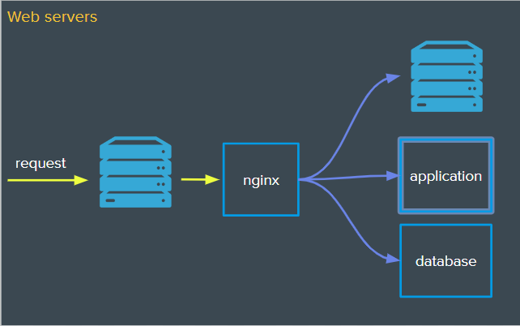
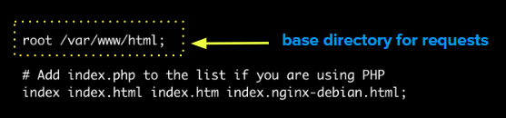
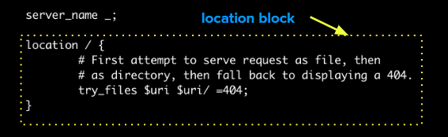

# Web Servers

## Nginx (engine-x)

- Web Server
- Reverse Proxy
- Forward Proxy



- **Install Nginx** - `sudo apt install nginx`
- **Start Nginx** - `sudo servce nginx start`
- **View Default nginx Configuration** - `less /etc/nginx/sites-available/default`



#### Location Block



- **Create and edit default page** - `sudo vi /var/www/html/index.html`

## Installing NodeJS

- `curl https://deb.nodesource.com/setup_19.x | sudo -E bash -`
- `sudo apt-get install nodejs`
- `sudo apt install git`

## Application Setup

- Change Ownsership of /www - `sudo chown -R $USER:$USER /var/www` 
- Make an application directory - `mkdir /var/www/app`
- Initialize empty git repo in /app - `git init`
- Create app file - `touch app.js`
- Initialize project - `npm init`
- Create a basic nodeserver in app.js

```javascript
const http = require("http");

http.createServer(function (req, res) {
        res.write("On the way to bein a full stack engineer!");
        res.end();
}).listen(3000);

console.log("Server started on port 3000");
```

- Start your application 

## Proxy Pass

- Create a new nginx server and proxy requests - `sudo vi /etc/nginx/sites-enabled/fsfe`
- 


