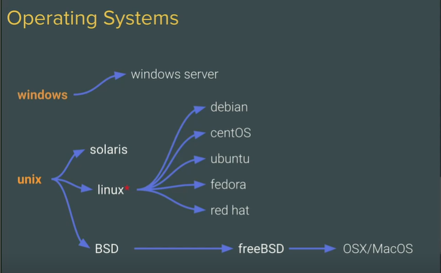
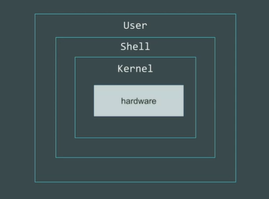

# Operating Systems

There are various OS that we can use:
- Windows
    - Windows Server
- Unix
    - Solaris
    - Linux
        - debian
        - centOS
        - ubuntu
        - fedora
        - red hat
        - arch
    - BSD
        - freeBSD
            - OSX/MacOS



## What's Inside OS?

```
Interesting part of the OS is everything is either a file or a process that's it.
```



- **Kernel** - Main part of OS. It's the one which talks with hardware.


    