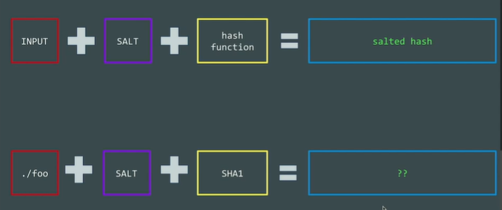
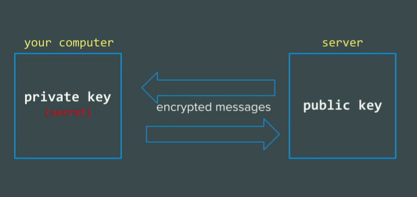

# Security & Hashing


- **Password** - It is not the best choice as we as a human are predictable.
- **Biometric** - It is also not the best choice as this solution is not portable.
- **SSH Key** - This is by far the best solution to safeguard our server.

## Hashing

You can perform the hashing in UNIX using

```unix
   echo password >> foo
```


- ***To Learn***
    - awk
    - grep

## Better Solution For Hashing is SALT



## SSH (Secure Socket Shell)

```unix
- It consists of Key Pair:
    - Public Key
    - Private Key (Here we uses Assymetric Cryptography)
```


### Way to Create SSH Key
```
- cd ~/.ssh
- ssh-keygen
```

## For Logging In

> Remember this that the first user ever created on the server is always called Root.

- SSH into your Server
```
    ssh root@<your_ip>
```

- SSH into your server your private key
```
    ssh -i ~/.ssh/project root@<your_ip>
```

- Exit your Server
```
    exit
```

To Know How Much Computer It has been Connected to
```
    cat ~/.ssh/known_hosts
```

## Modifying SSH Config File SO That It Shoul Pick The Identity File By Itself Everytime

```
- Note:
    - If you don't have config file from the start then just create it by using `vi`
```

- `cd ~/.ssh`
- `vi config`

Inside the config file have these line of code

```
Host *
        IgnoreUnknown UseKeyChain
        AddKeysToAgent yes
        UseKeychain yes
        IdentityFile ~/.ssh/<Provide Your Private Key File Name>

<!-- BELOW LINE IS JUST EXPLANATION OF ABOVE -->

<!-- This code is a configuration for the SSH client, and it specifies default settings that apply to all hosts that you connect to using SSH. Here's a brief explanation of each line:

Host *: This line specifies that the following configuration options apply to all hosts.

IgnoreUnknown UseKeyChain: This line tells the SSH client to ignore any unknown options related to the macOS keychain. This is useful for compatibility with older versions of macOS.

AddKeysToAgent yes: This line tells the SSH client to automatically add any private keys that you use for authentication to the SSH agent.

UseKeychain yes: This line tells the SSH client to use the macOS keychain to store passphrases for private keys.

IdentityFile ~/.ssh/project: This line specifies the path to the private key file that should be used for authentication when connecting to a remote host. In this case, the private key file is named project and is located in the ~/.ssh directory. -->
```

- Check that the <your private key file> file has the correct permissions. The file should have permissions of 600 (or -rw-------). You can set the correct permissions using the following command: `chmod 600 ~/.ssh/<your private key file name>`

- If you have multiple SSH key pairs, make sure that you're specifying the correct filename in the keychain command. For example, if your private key file is named project, you would need to run: 

```
    eval `keychain --eval --agents ssh project`
```

- If none of the above solutions work, try running the ssh-agent command manually before running keychain. For example:

```
    eval `ssh-agent`
    ssh-add ~/.ssh/<your private key file name>
    eval `keychain --eval --agents ssh <your private key file name>`
```

*This should start the ssh-agent, add your private key to it, and then run keychain.*

## Now After Previous Step We can Login Directly Without Specifying Identity File

- `ssh root@<your server ip address>`
