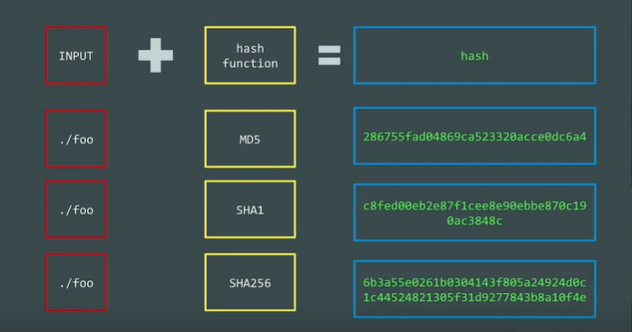

# Security & Hashing


- **Password** - It is not the best choice as we as a human are predictable.
- **Biometric** - It is also not the best choice as this solution is not portable.
- **SSH Key** - This is by far the best solution to safeguard our server.

## Hashing

You can perform the hashing in UNIX using

```unix
   echo password >> foo
```




- ***To Learn***
    - awk
    - grep

## Better Solution For Hashing is SALT

